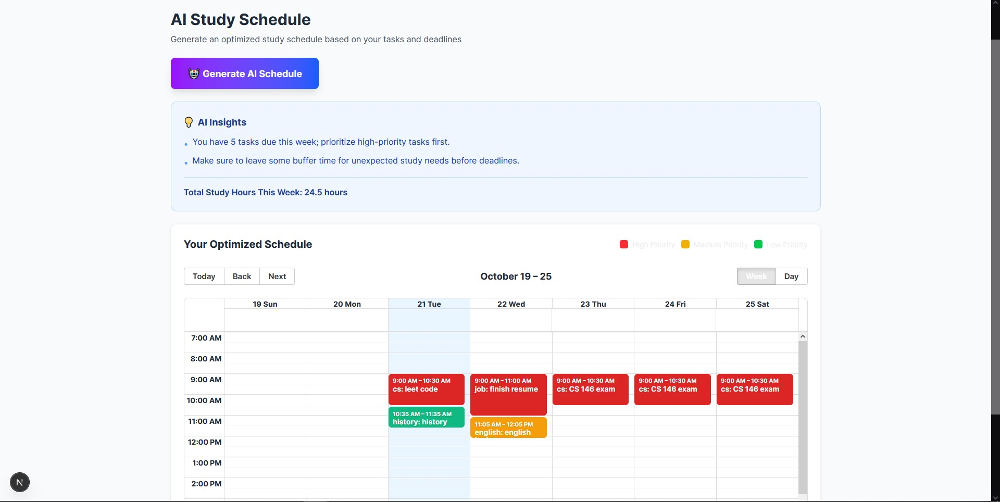

# 📚 StudySync - AI-Powered Study Session Optimizer

A full-stack productivity platform that helps students optimize their study schedules using AI-powered insights and Pomodoro time tracking.


## 🌐 Live Demo

**[View Live Application →](https://study-session-optimizer.vercel.app/)**

**Test Account:**
- Email: `email of your choice`
- Password: `password of your choice!`

*Or create your own account - no email verification required!*

---

## ✨ Features

### 🎯 Smart Task Management
- Create, edit, and delete study tasks with deadlines
- Set priority levels (High, Medium, Low)
- Estimate time required for each task
- Track actual time spent vs. estimated
- Auto-hide overdue tasks

### ⏱️ Pomodoro Timer Integration
- Built-in 25-minute Pomodoro timer with visual countdown
- Automatic break scheduling (5 min short breaks, 15 min long breaks after 4 Pomodoros)
- Session persistence - all study sessions saved to database
- Browser notifications for completed Pomodoros and breaks
- Real-time progress bar and Pomodoro counter
- Updates task `actualHours` automatically

### 🤖 AI Schedule Generation
- **Powered by OpenAI GPT-4o-mini**
- Generates optimized weekly study schedules based on your tasks
- Considers task priorities, deadlines, and estimated hours
- Implements spaced repetition principles across multiple days
- Smart break allocation between study sessions
- **Automatically filters out past dates** - only schedules from today onwards
- Provides personalized AI insights and study recommendations
- Visual calendar view with color-coded priorities (High=Red, Medium=Orange, Low=Green)

### 📊 Advanced Analytics Dashboard
- **Study metrics**: Total Pomodoros completed, hours studied, current study streak
- **Accuracy tracking**: Compare estimated vs. actual time for each task
- **Visual charts**: 
  - Line chart showing daily study time over last 7 days
  - Bar chart displaying study time breakdown by subject
- **AI-powered insights**: 
  - Productivity pattern analysis (peak study hours)
  - Time estimation accuracy feedback
  - Subject-specific underestimation warnings
  - Motivational streak tracking
- **Task performance table**: Detailed view with color-coded accuracy ratings (Green ≥80%, Yellow ≥60%, Red <60%)
- **Enhanced readability**: Bold, high-contrast text for all metrics

### 🔐 Authentication
- Secure JWT-based authentication
- User registration and login
- Protected routes and API endpoints
- Persistent sessions

---

## 📸 Screenshots

### Dashboard Overview

*Main dashboard showing study stats and quick actions*

### Task Management

### Create Task

*Create and manage tasks with deadlines and priorities*

### AI-Generated Schedule


*AI-optimized weekly study schedule with color-coded priorities*

### Pomodoro Timer

*25-minute focus sessions with progress tracking*

### Analytics Dashboard


*Detailed insights and study pattern analysis*

---

## 🚀 Tech Stack

### Frontend
- **Framework**: Next.js 15 (App Router)
- **Language**: TypeScript
- **Styling**: Tailwind CSS
- **Charts**: Recharts
- **Calendar**: React Big Calendar
- **Icons**: Lucide React

### Backend
- **Runtime**: Node.js
- **API**: Next.js API Routes
- **Database**: MongoDB with Mongoose ODM
- **Authentication**: JWT (jsonwebtoken + bcryptjs)
- **AI**: OpenAI API (GPT-4o-mini)

---

## 📦 Installation

### Prerequisites
- Node.js 18+
- MongoDB database (local or MongoDB Atlas)
- OpenAI API key

### Setup

1. **Clone the repository**
   ```bash
   git clone https://github.com/tuanwinnn/study-session-optimizer.git
   cd study-session-optimizer
   ```

2. **Install dependencies**
   ```bash
   npm install
   ```

3. **Set up environment variables**
   
   Create a `.env.local` file in the root directory:
   ```env
   # MongoDB
   MONGODB_URI=your_mongodb_connection_string

   # JWT Secret (use a strong random string)
   JWT_SECRET=your_secure_jwt_secret_key

   # OpenAI API
   OPENAI_API_KEY=your_openai_api_key
   ```

4. **Run the development server**
   ```bash
   npm run dev
   ```

5. **Open your browser**
   
   Navigate to [http://localhost:3000](http://localhost:3000)

---

## 🚀 Deployment (Vercel)

1. **Push to GitHub**
   ```bash
   git add .
   git commit -m "Initial commit"
   git push origin main
   ```

2. **Deploy to Vercel**
   - Go to [vercel.com](https://vercel.com)
   - Import your GitHub repository
   - Add environment variables (`MONGODB_URI`, `JWT_SECRET`, `OPENAI_API_KEY`)
   - Deploy!

---

## 📝 API Documentation

### Authentication
- `POST /api/auth/register` - Register new user
- `POST /api/auth/login` - Login user
- `GET /api/auth/me` - Get current user

### Tasks
- `GET /api/tasks` - Get all user tasks
- `POST /api/tasks` - Create new task
- `PUT /api/tasks` - Update task
- `DELETE /api/tasks?id={taskId}` - Delete task

### Sessions (Pomodoro)
- `GET /api/sessions` - Get all study sessions
- `POST /api/sessions` - Start new session
- `PUT /api/sessions` - Complete session

### AI Schedule
- `POST /api/schedule` - Generate AI-optimized schedule

### Analytics
- `GET /api/analytics` - Get study analytics and insights

---

## 🎨 Key Features Explained

### AI Schedule Generation
The AI analyzes your tasks and generates an optimized study schedule by:
- Prioritizing tasks with closer deadlines
- Allocating more time to high-priority tasks
- Breaking large tasks into manageable 2-hour sessions
- Implementing spaced repetition across days
- Suggesting study times based on your preferences
- Leaving buffer time before deadlines

### Pomodoro Timer System
- **Focus sessions**: 25 minutes of concentrated work
- **Short breaks**: 5 minutes after each Pomodoro
- **Long breaks**: 15 minutes after every 4 Pomodoros
- All sessions are saved to the database and update task `actualHours`
- Session data feeds into the analytics dashboard

### Analytics & Insights
The system tracks:
- **Estimation accuracy**: How well you predict task duration
- **Productivity patterns**: Your most productive hours
- **Study streaks**: Consecutive days of studying
- **Subject breakdown**: Time spent per subject
- **AI recommendations**: Personalized tips based on your data

---

## 🛠️ Project Structure

```
study-session-optimizer/
├── app/
│   ├── analytics/         # Analytics dashboard page
│   ├── api/              # API routes
│   │   ├── analytics/    # Analytics data endpoint
│   │   ├── auth/         # Authentication endpoints
│   │   ├── schedule/     # AI schedule generation
│   │   ├── sessions/     # Pomodoro session tracking
│   │   └── tasks/        # Task CRUD operations
│   ├── components/       # React components
│   ├── dashboard/        # Main dashboard page
│   ├── schedule/         # AI schedule view
│   └── tasks/           # Task management page
├── lib/
│   ├── auth-context.tsx  # Auth state management
│   ├── auth.ts          # JWT utilities
│   └── mongodb.ts       # Database connection
├── models/
│   ├── Task.ts          # Task schema
│   ├── User.ts          # User schema
│   └── StudySession.ts  # Session schema
└── public/              # Static assets
```

---

## 💡 Usage Tips

1. **Create Tasks First**: Add assignments with realistic deadlines and time estimates
2. **Generate AI Schedule**: Click "Generate AI Schedule" to get an optimized study plan
3. **Start Pomodoro Sessions**: Click "⏱️ Start Focus" on any task to begin a 25-minute session
4. **Complete Full Cycles**: Let the timer run to completion for accurate tracking
5. **Review Analytics**: Check the Analytics page to see your productivity patterns
6. **Improve Estimates**: Use the accuracy feedback to get better at time estimation over time
7. **Maintain Streaks**: Study daily to build and maintain your study streak 🔥

---

## 🎯 Future Enhancements

- [ ] Mobile app (React Native)
- [ ] Collaborative study rooms with real-time sync
- [ ] Flashcard system with spaced repetition algorithm
- [ ] Google Calendar integration
- [ ] Study goal setting with progress milestones
- [ ] Dark mode theme
- [ ] Export analytics reports (PDF/CSV)
- [ ] Gamification (achievements, badges, leaderboards)
- [ ] AI study buddy chat for Q&A
- [ ] Spotify integration for focus playlists
- [ ] Study group scheduling and coordination

---

## 🤝 Contributing

Contributions are welcome! Please follow these steps:

1. Fork the repository
2. Create a feature branch (`git checkout -b feature/AmazingFeature`)
3. Commit your changes (`git commit -m 'Add some AmazingFeature'`)
4. Push to the branch (`git push origin feature/AmazingFeature`)
5. Open a Pull Request

---

## 📄 License

This project is licensed under the MIT License.

---

## 📧 Contact

**Tuan Nguyen**
- GitHub: [@tuanwinnn](https://github.com/tuanwinnn)
- LinkedIn: [Tuan Nguyen](https://www.linkedin.com/in/tuan-nguyen-win/)

---

## 🙏 Acknowledgments

- OpenAI for GPT API
- Next.js team for the amazing framework
- MongoDB for reliable data storage
- Recharts for beautiful visualizations

---

**Built with ❤️ by [Tuan Nguyen]**

*Making studying smarter, not harder.*
